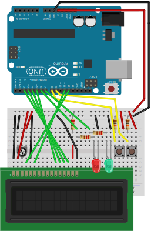
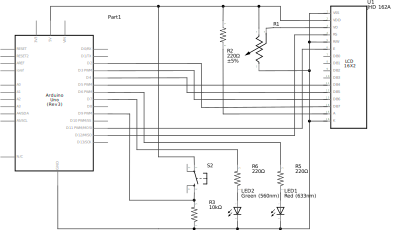

# Pommodoro Timer based on Arduino

## Description

This is an Arduino-based Pommodoro timer. It's intended as an accessory to help working by the
[Pommodoro technique](https://en.wikipedia.org/wiki/Pomodoro_Technique) for personal productivity. 
It requires an Arduino (tested with Arduino Uno) with some additional hardware: LCD, switches 
and LEDs (documented below).

## How to use

You should read the entire documentation and the book on how to practice Pommodoro properly - this
is only a short summary how this device can help.

Press the start/stop key to start a Pommodoro. This will start the countdown of 25 minutes. A 
red LED will also illuminate while the pommodoro is active, meaning "do not interrupt activity 
in progress".

```
▉▉▉▉▉▉▉▉▉▉▉▉▉▉▉
    1500 sec
```

When  a Pommodoro is completed, the green LED will blink to remind you that you can take a break.
The device will display how much time has passed since the end of the last pommodoro:

```
 Last: completed
    15m ago
```

You can determine when it's time to end the breaks (3-5 minutes for short breaks, 15-30 minutes
for long breaks). This is also intended to nudge you out of procrastination. A blinking green light
is intended to remind you that a break is in progress, but you should not take too much time.

If some external interruption occurs that warrants aborting a Pommodoro when it's in progress, 
you press the start/stop key again to abort. The device will show how long ago the abort happened:

```
  Last: aborted
     23m ago
```

There's no additional functionality, such as tracking the long and short breaks, work targets, ...
The author of the Pommodooro technique recommends these to be done manuallly on pen and paper.
The point of this device is only to help tracking time.

## Limitations

This is prototype for now  - I plan to design a 3D printed case for that, but it's not implemented yet.

Power usage is not yet optimized, so it's recommended to be used plugged (USB or power supply), 
batteries won't last long. On Arduino Uno it uses 70mA, while the 9V battery tipically can 
supply 500mAh, so it will last less than a working day.

## FAQ

### Why separate device? There's an app for that!

True, there are many apps for working with the Pommodoro technique, but it's less disrupting to 
have a separate device for that, because you don't have to switch apps, move mouse and click, ....

True, you can use an old Android/iPhone that you dedicate for Pommodoro timer app.

## Assembly

### The circuit

I used components from the Arduino Starter Kit - other components can be used.

Breadboard view (maintained in [Fritzing file](circuit/pommodoro-timer.fzz)).



Schematics:



Connections:

LCD:  connected as documented in the LCD [Hello world example](https://www.arduino.cc/en/Tutorial/LibraryExamples/HelloWorld).
I used JHD 162A LCD - any LCD screen 16x2, that is compatible with Arduion LiquidCrystal library 
can be used, but some may require changes.

* LCD RS pin to digital pin 12
* LCD Enable pin to digital pin 11
* LCD D4 pin to digital pin 5
* LCD D5 pin to digital pin 4
* LCD D6 pin to digital pin 3
* LCD D7 pin to digital pin 2
* LCD R/W pin to ground
* LCD VSS pin to ground
* LCD VCC pin to 5V
* R1: 10K trimmer to adjust LCD contrast, ends to +5V and ground, wiper to LCD VO pin (pin 3)
* R2: current limiter for LCD backlight to LCD A pin
* LCD K pin (backlight LED cathode) to ground

Buttons:

* digital pin 9: START/STOP button

LEDs:

* digital pin 6: "Pommodoro in progress" LED, I use a red LED
* digital pin 7: "Waiting" LED, I use a green LED

### Software

Using the Arduino environment, open and load CircuitTest/CircuitTest.ino sketch to verify correct assembly:
should illuminate both LEDs and print the state of the button on the LCD.

Open and load the PommodoroTimer/PommodoroTimer.ino sketch for the main firmware.
